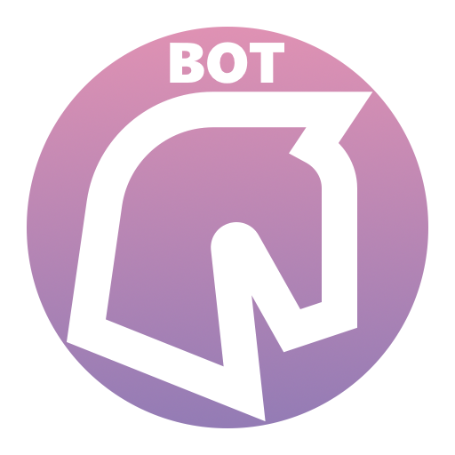

<!--Generated Line-->

<!--/Generated Line-->

    
# Icons Guide

1. Make sure you have `Effects > Object > Apply Mask`, otherwise get it from [here](https://forums.getpaint.net/topic/121343-boltbaits-gpu-accelerated-plugin-pack-for-paintnet-v50-updated-2024-04-29/).
1. [Find an icon](https://pictogrammers.com/library/mdi/) and [save it as a paint.net shape](https://forums.getpaint.net/topic/116525-material-design-icon-shapes-in-paintnet/).
1. Enable the `Icon Bounds` layer, and make a new one above it titled `<your abbreviation> Icon`.
1. Put `#FFFFFF` as your primary color, and set your secondary color to 0 Opacity.
1. Draw your custom shape with an outline, adjusting it to hit the top and bottom of the bounding box, and centering it.
    - Brush Size: `20`
1. Make sure the `Base` layer at the top is on.
1. Use the Magic Wand to select the exterior of your icon.
    - Tolerance: `80`
1. Go to the `Base` Layer, Set the Wand's mode to `Intersect` and select the interior of the Base.
1. Create a New Layer above your Icon called `<your abbreviation> Mask`.
1. Fill your Selection.
1. Create a New Layer beneath your Icon called `<your abbreviation> Color`.
1. Copy `Color Streak`'s content to your new layer.
1. Use `Effects > Object > Apply Mask`
    - The Effect is buggy and must open with your `Mask` layer selected to work.
    - If the Effect is not opening with your `Mask` layer selected you can check what layer it is opening to, and -with some trial and error- move your `Mask` layer to where that layer is.
1. Create a New Layer above your Color called `<your abbreviation> Text`
1. Add Text of `<your abbreviation>` in all caps.
    - Font: `Segoe UI Black`
    - Size: `108`
    - Align: `Right`
1. Move the grabber until you are at X: `256`.
1. Set your Text to be Center-Aligned.
1. Adjust your Text up/down until centered vertically within the Base.
1. Create a folder in this repo titled `<your abbreviation>` in all caps.
1. Delete layers belonging to other abbrevations, but not the utility layers like `zColor Streak`.
1. Save the `.pdn` of your project into your folder with `<your abbreviation>` in all caps as the file name.
1. Save As a `.png` of your project into the folder with `icon` as the file name.
    - Flatten to a `.png`
    - Bit Depth: `Auto`
    - Algorithm: `Octree`
    - Dithering: `7`
    - Transparency: `44`

---

    Just-Some-Plugin Graphical Assets: for the organization's branding.
    Copyright (C) 2025  Ethan Henderson (zbee) <ethan@zbee.codes>

    Assets primarily use PictoGrammer's Material Design Icons.
    (C) Copyright 2023  Pictogrammers. https://pictogrammers.com/docs/general/license/

     This program is free software: you can redistribute it and/or modify
     it under the terms of the GNU Affero General Public License as published
     by the Free Software Foundation, either version 3 of the License, or
     (at your option) any later version.

     This program is distributed in the hope that it will be useful,
     but WITHOUT ANY WARRANTY; without even the implied warranty of
     MERCHANTABILITY or FITNESS FOR A PARTICULAR PURPOSE. See the
     GNU Affero General Public License for more details.

     You should have received a copy of the GNU Affero General Public License
     along with this program. If not, see <https://www.gnu.org/licenses/>. 
